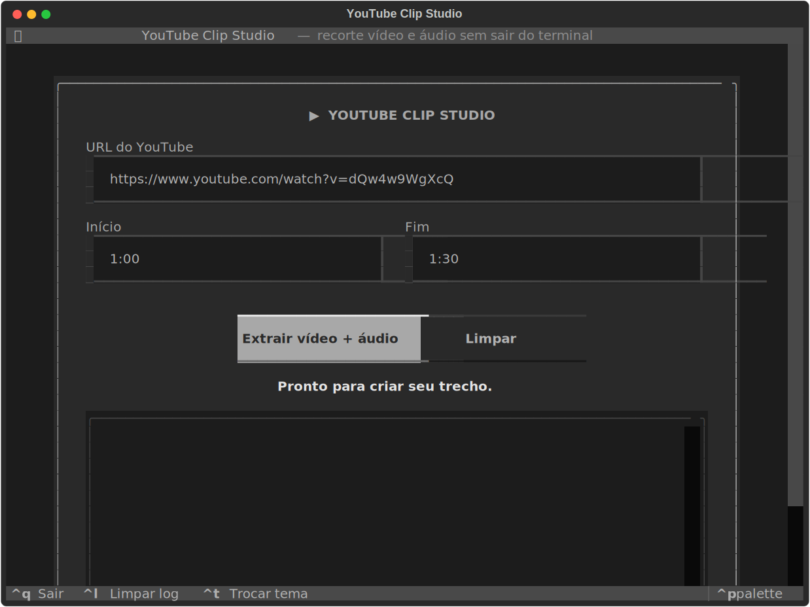
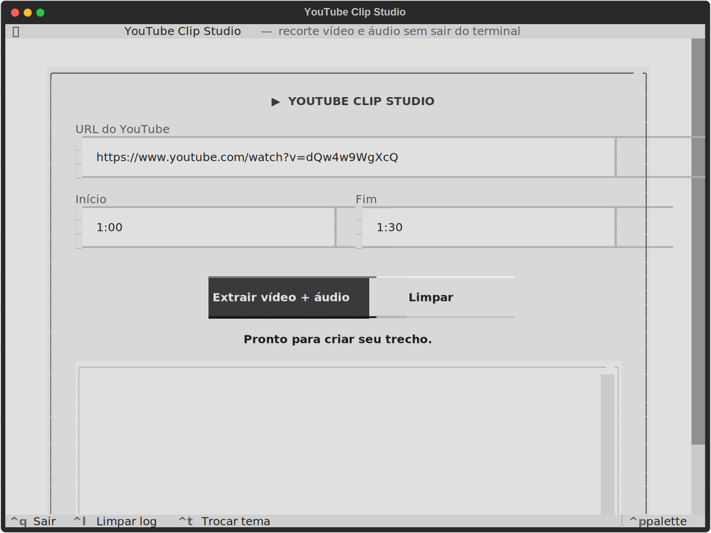

# YouTube Clip TUI

Uma interface de terminal para baixar apenas um trecho de um vídeo do YouTube e gerar:

- vídeo em MP4;
- áudio em MP3.

## Interface

<p align="center">
  
  
</p>

## Executar

```bash
git clone https://github.com/brilvio/youtube-clip.git
cd youtube-clip
uv run youtube-clip
```

Na primeira execução, o `uv` pedirá/mostrará a instalação das dependências do projeto. Informe a
URL e os timestamps inicial e final, como `1:00` e `1:30`. Os arquivos serão gravados em
`downloads/`.

Use `Ctrl+T` para alternar entre os temas Tokyo Night, Catppuccin, Nord e claro.

O FFmpeg é um pré-requisito do sistema. No Ubuntu e distribuições derivadas, instale com:

```bash
sudo apt install ffmpeg
```

## Desenvolvimento

```bash
uv run pytest
uv run ruff check .
```

Baixe apenas conteúdo que você tenha autorização para usar e respeite os termos do YouTube.
